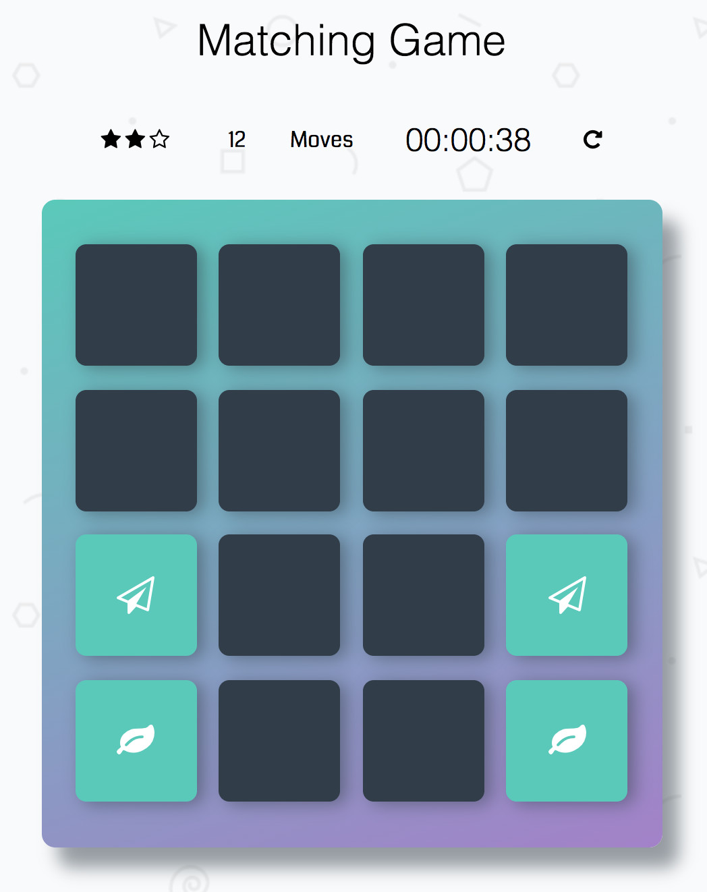

# Memory Game Project

## How to play this game

Find the right pair of cards by click:point_up_2:, and match all the 16 cards correctly, as soon as possible!:alarm_clock: You can see your time:clock4: and star rating :star2::star2::star2: after the game is over.

## Meaning to me

It's actually the first time to fully combine HTML, CSS and Javascript into hundreds of lines of code. Through this project, I became more confident and familiar with HTML & CSS, Javascript.

## Thanks to

Udacity instructors, my mentor Sang Han, and all the slack channel people!